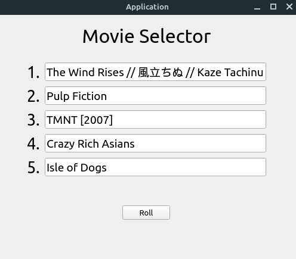

# Movie Selector
I created this simple program to help randomly select movies that my friends and I would then vote on to watch for a movie night. The process is simple:

1. Get people to submit movie suggestions through a Google form. The submission is then sent to a Google sheet. 
2. Then the program will access the spreadsheet and obtain the list of suggested movies.
3. The program will then randomly select 5 movies and display the suggestions.

This program is primarily for personal use. If you would like to use this program yourself, you can clone the project but you may need to make some changes to the program code. 

# Prerequisites

* Access to Google Sheets API. Please see [this tutorial](https://developers.google.com/sheets/api/quickstart/python) to learn how to do that. 
* PyQt5
* google-api-python-client 
* google-auth-httplib2 
* google-auth-oauthlib

For PyQt5 and the Google libraries, you can use `pip install` to install them.

# Setting Up

You may need to make a couple of changes to the `MovieSelector.py` file before you can use this program.

* Line 119 has the line, `sheet = client.open('List of Suggested Movies')`. You'll need to replace "List of Suggested Movies" to the name of your Google sheets file or make a Google sheets file called that.
* Line 112 has the line, `allMovies = sheet_instance.col_values(2)`. I have my list of movie titles in the second column of my sheet. If your list of movie titles is in another colummn, replace the value with another number.

That should be all you need to do.

# Using the Program

If you have the required Python libraries and if you had made the appropriate changes to the code as specified in the previous section, then you simply need to go to the project folder and type in the following command:

`python MovieSelector.py`

The program should then launch and you'll be able to use it right away. Enjoy!